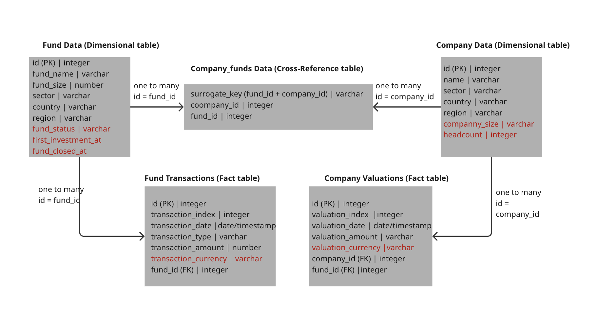

# DBT project

## Glossary
1. [Introduction: Data modeling](#data-modeling)
2. [Setting up DBT environment locally](#setting-up-dbt-environment-locally)
3. [DBT folder structure](#dbt-folder-structure)
4. [NAV Exercises](#nav-exercises)
5. [Tests](#tests)

## Data Modeling



Above you can see schematic representation of a data model.

**Dimensional Tables:**
- **Fund Data**: Contains fund information.
- **Company Data**: Stores information about companies within funds.

**Fact Tables:**
- **Fund Transactions**: Records all fund-related transactions.
- **Company Valuations**: Tracks company valuation events.

**Cross-Reference Table:**
- **Company_funds Data**: Establishes many-to-many relationships between companies and funds using a surrogate key


**Key considerations during design**

The data model design is based on the extracts provided on google sheets. With current data structure there is **no clearly defined unique keys** in either of the tables, as well as **lack of foreign keys** to be able to join data reliably. The current fund_data & company_data is difficult to join as we are only relying on Fund name & transactional timestamps.

As expected, storing data on gsheets is prone to human error and lacks data quality controls. Several issues have been found during data exploration:

1. Lack of foreign and primary keys
2. Transaction_index values are not all integers (e.g. fund_data has index value of 1.000021)
3. Date is not properly formatted - need to use ISO format
4. Inconsistent way of recording data (country recorded both as full name and 3 letter code - USA vs United States)
5. Empty values for country/regions fields in company_data. Additionally, N/A should not be used and replaced with NULL
4. No "auditing columns", i.e. when was this record was ingested and updated.

It is also important to consider what extra data we would require to uncover more analytical insights. The proposed additional columns are highlighted in red on the above diagram. 

**Proposed columns to include:**
Apart from the obvious foreign and primary keys missing from the original data extracts:
1. fund status - is it still active or closed etc. 
2. first investment date - when first investment happened
3. closure date - for when PE is no longer investing into the fund
4. company size - e.g. startup, skaleup, enterprise etc
5. headcount - how big is the company based on headcount
6. fund transaction/ company valuation transaction currency - transactions might be happening in various currencies.

**Loading Data into Snowflake**

Data loaded using [`load_data_to_snowflake.py`](./scripts/load_data_to_snowflake.py)

Includes:
- Reading data from gsheet
- Loading into dataframe 
- Authentication to snowflake 
- loading table into snowflake

---

## Setting up DBT environment locally

**Creating local env**

1. You will need to set up a virtual environment first: ```python3.12 -m venv ~/dbt_venv```. Use python >3.9

2. Activate your virtual environment  ```~/dbt_venv/bin/activate```

3. Install dbt and dbt adaptor depending on what you are using. ```pip3 install dbt-core==1.9.3 dbt-snowflake==1.9.2``` These can also be latest versions.


**Setting Up Snowflake Account**

1. [Sign up Page](https://signup.snowflake.com/?utm_source=google&utm_medium=paidsearch&utm_campaign=em-it-en-brand-core-phrase&utm_content=go-eta-evg-ss-free-trial&utm_term=c-g-snowflake-p&_bt=592101833503&_bk=snowflake&_bm=p&_bn=g&_bg=127319539665&gclsrc=aw.ds&gad_source=1&gad_campaignid=14829379135&gbraid=0AAAAADCzRJULl67UBqa7csO5ShXNLeutd&gclid=CjwKCAjwhuHEBhBHEiwAZrvdcj2Cb2a0sG_vBcXhp1R_sAE4wuTCUQlN0Rjh6rFvti5Gdh8FCveEbBoC7ugQAvD_BwE). Very easy and quick to sign up and has a free trial for initial playground.
2. Created ANALYTICS_DB and PLAYGROUND_DB. The former DB would be used as production database for schemas containing ingestion data, the latter is to allow users create their own table in the dev environment.
3. Also included two main warehouses - PLAYGROUND (adhoc queries) & SCHEDULER (for running jobs on schedule i.e. through airflow) 

Alternatively, use docker & local postgres which is more straightforward.

**Setting up dbt project**

1. Normally one would clone this repo within a company, provided right access to the project & snowflake user account. To set this up properly against your own database, a fork will have to be created.

Project Configuration Files:
- [dbt_project.yml](./dbt/dbt_project.yml) - Main dbt project configuration
- [profiles.yml](./dbt/profiles.yml) - Database connection profiles

**Project Configuration Files:**

1. [profiles.yml](./dbt/profiles.yml) - Database connection profiles
Here is the example of how you can create a dev profile
``` 
airflow:
  target: "{{ env_var('DBT__DEFAULT_TARGET') }}" # default target 
  outputs:
    dev:
      type: snowflake
      account: account_identifier
      # Token authentication (recommended)
      token: "{{ env_var('SNOWFLAKE_TOKEN') }}"
      # Username/password
      user: "{{ env_var('DBT_SECRET__USER') }}"
      password: "{{ env_var('DBT_SECRET__PASSWORD') }}"
      database: PLAYGROUND_DB
      warehouse: PLAYGROUND_WH
      schema: "{{ env_var('DBT__USER_SCHEMA') }}"
      threads: 1
```

Configuration Fields Explanations:
- `airflow`: Profile name that is coming from [dbt_project.yml](./dbt/dbt_project.yml) - this can be any name you choose.
- `target`: points to default output when more than one is present (dev/prod/staging/ci). 
- `type`: Database adapter type, in this case - snowflake
- `account`: Your snowflake account identifier
- `token`: use snowflake auth token to connect to database
- `user`: Your Snowflake username
- `password`: Your Snowflake password (env variables and/or use SSO for dev log in)
- `database`: The Snowflake database where your data resides
- `warehouse`: Compute warehouse for running queries
- `schema`: Default schema for your models (uses environment variable for dynamic naming)
- `threads`: Number of concurrent connections dbt can use to execute models in parallel. Depends on WH resources vs model pipeline complexity

  
2. [dbt_project.yml](./dbt/dbt_project.yml) - Main dbt project configuration

name & profile can be renamed but nothing needs to be changed to get you started.

**Running First dbt commands**
1. Run  ``` dbt debug ``` to test the connection
2. If successful, run ```dbt deps ``` to install all packages one might require 
3. Run ```dbt seed ``` to test that you can execute generation of some seed files
4. You can now use ```dbt build``` or ```dbt run``` to run models. Please refer to [dbt command guide](https://docs.getdbt.com/reference/dbt-commands) for more detailed explanation.

---

## DBT Folder Structure
Key folder structure outlined below
```
dbt/
├── dbt_project.yml # Main project configuration
├── profiles.yml  # Database connection profiles
├── packages.yml  # Package dependencies
├── dbt_packages/               # Installed packages
│
├── sources/                    
│   ├── sources.yml  # source table definitions
│
├── models/ 
│   ├── staging/  # create a view on top of source
│   │
│   ├── intermediate/  # Clean up and major transformations
│   │
│   └── core/  # Stakeholder ready models
│
├── seeds/ # Static data files (CSV)
│
├── macros/  # Reusable SQL functions
│
├── tests/ # Custom data tests
│
├── snapshots/ # For slowly changing dimension tables
````

---

## NAV Exercises

The project includes several NAV (Net Asset Value) calculation models:

- [`fund_nav.sql`](./dbt/models/core/fund_nav.md) - Calculates fund-level NAV based on transactions
- [`company_nav_new.sql`](./dbt/models/core/company_nav_new.md) - Company-level NAV calculation
- [`company_nav.sql`](./dbt/models/core/company_nav.md) - Alternative company-level NAV calculation

---

## Tests 

1. Use in-built tests like unique & not null to make sure there are no duplicates & no unexpected null values where required

2. You can write custom tests like:
   - [`test_date_formatting.sql`](./dbt/tests/generic/test_date_formatting.sql) - Custom test for date formatting validation 

3. One may consider using conditional testing on the columns where null values are expected for certain 

4. Use expected values tests where all values are not null and predefined (type of transaction, sector type etc)
````yaml
   tests:
      - not_null
      - accepted_values:
            values: ['Commitment', 'Valuation', 'Call', 'Distribution'] 
````

5. Since NAV is tracked on specific days, a custom test can be applied to track company NAV change drastically and a report can be sent directly to the stakeholder.  [`fund_nav_simple.py`](./scripts/fund_nav_simple.py) - automated is an example of how you can do it.

To track performance of your model in terms of data quality and maintenance, you can track % of failed tests on each model over time.
